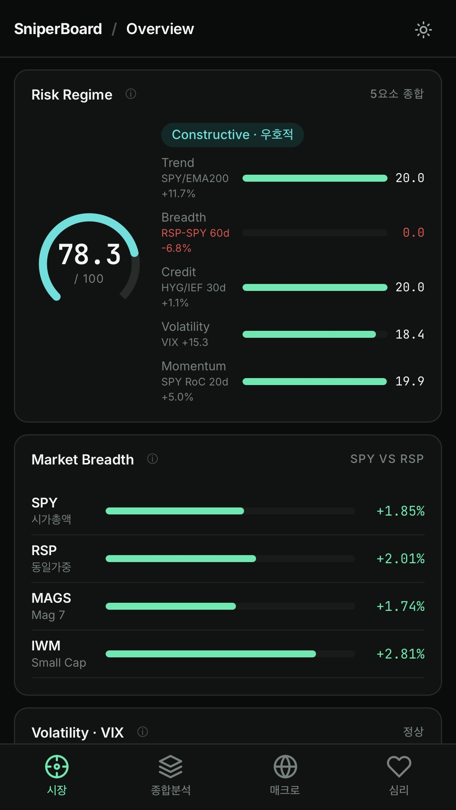
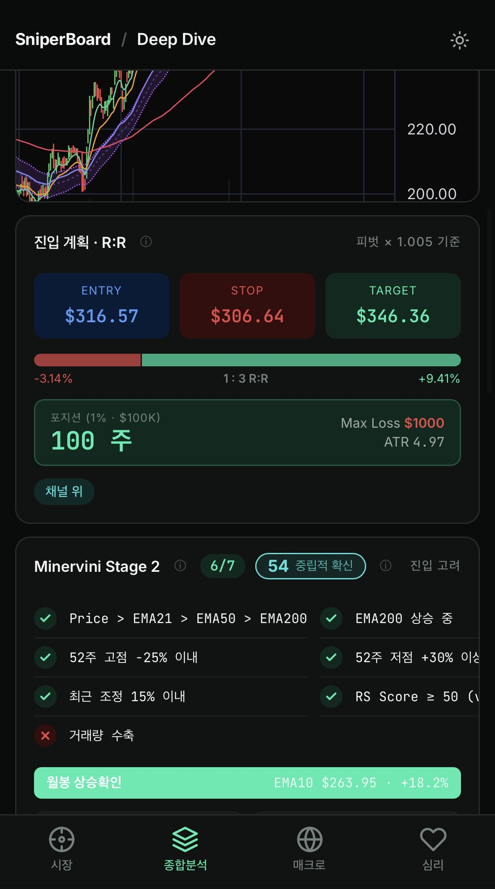
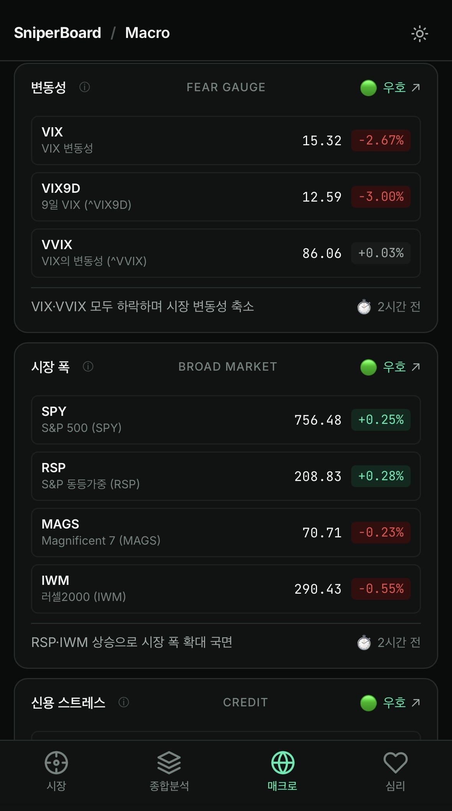
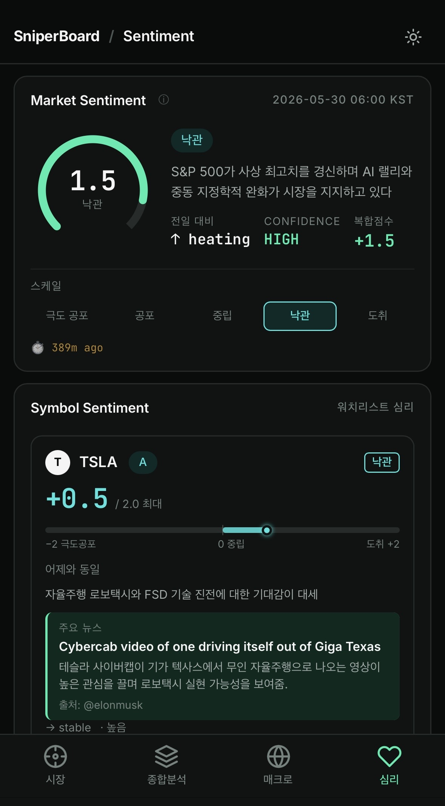
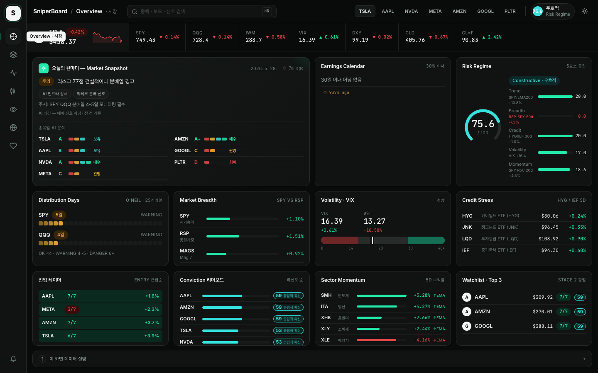
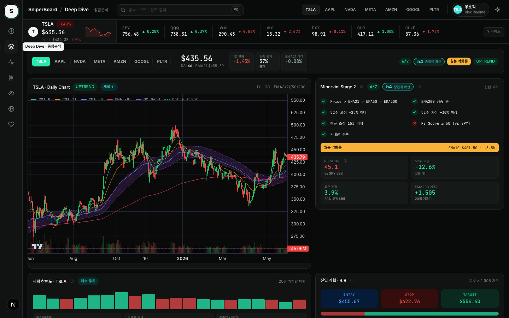
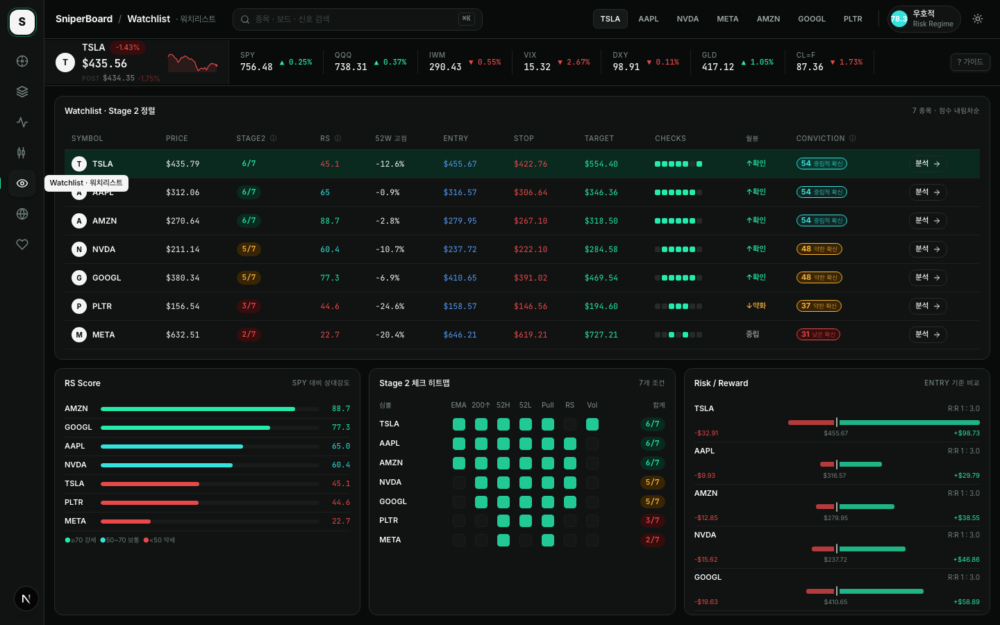
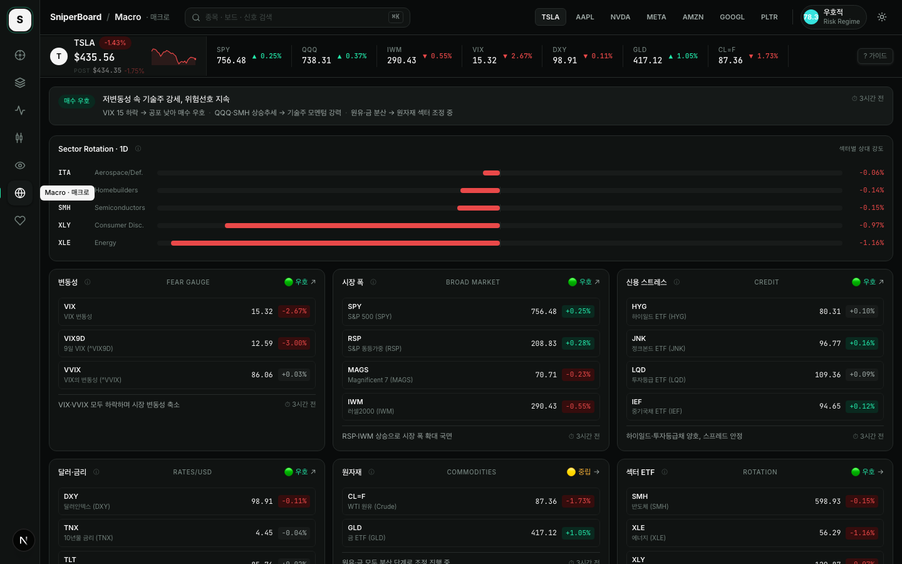
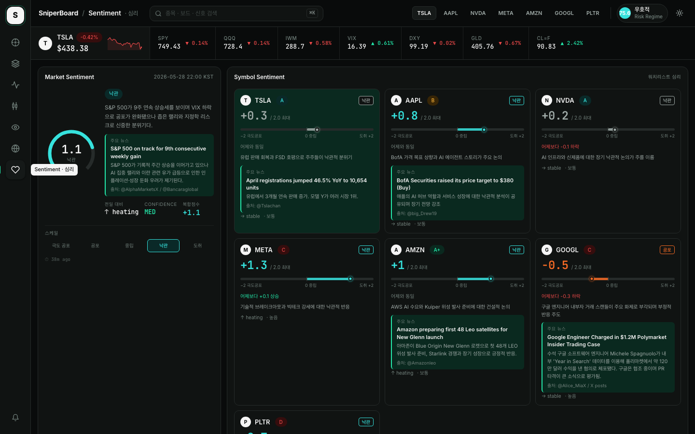

> English docs: [README.md](./README.md)

# SniperBoard

**Precision Signal Dashboard for US Equities**
*Livermore · O'Neil · Minervini 전략 기반 스윙 트레이딩 대시보드*

[](https://nextjs.org/)
[](https://fastapi.tiangolo.com/)
[](https://python.org/)
[](https://docs.docker.com/compose/)

---

## 개요

SniperBoard는 미국 주식 스윙 트레이딩을 위한 웹 기반 매매 신호 대시보드입니다.

- **백엔드**: FastAPI + yfinance + pandas — 기술 지표·매매 신호 실시간 계산
- **프론트엔드**: Next.js 16 + lightweight-charts — 인터랙티브 차트 및 7개 전문 보드
- **AI 파이프라인**: Grok/Hermes 모델이 기술 지표 + 소셜 심리를 결합해 시장 내러티브 생성 (외부 cron)
- **신호 철학**: VCP·Sniper·Pullback (O'Neil/Livermore) + Stage 2 (Minervini) + Conviction 종합 점수 + Risk Regime + Distribution Day
- **언어 지원**: Topbar의 EN/KO 토글 버튼 — UI 레이블·용어 28개·신호 설명·매크로 심볼명·AI 생성 텍스트 즉시 전환. AI 데이터는 이중 언어 `_en`/`_ko` 필드(schema v2.0) 사용. v1.x 데이터는 자동 폴백 처리.

Plaid DS 기반 다크/라이트 테마 전환 지원. ⌘K 커맨드 팔레트로 종목·보드 빠른 이동. 각 지표·카드마다 ⓘ 버튼으로 맥락 설명 팝오버 제공(뷰포트 경계 자동 보정), MarketStrip 우측의 `? 가이드` 버튼으로 보드 전체 사용 가이드를 슬라이드오버로 확인 가능. ⌘K 입력창에 `?`를 입력하면 28개 용어 검색 모드로 전환.

---

## 빠른 시작

### 요구사항

- Docker & Docker Compose v2

### 실행

```bash
git clone <repo-url>
cd sniperboard

# 1. 환경변수 파일 생성 (최초 1회)
cp .env.example .env

# 2. 빌드 및 실행
docker compose up --build -d
```

| 서비스 | URL |
|--------|-----|
| 대시보드 | http://localhost:4000 |
| API 문서 | http://localhost:5001/docs |

> 첫 로딩 시 yfinance 데이터 다운로드로 30초~2분 소요될 수 있습니다.

---

## 모바일 지원

iOS Safari / Android Chrome 에서 동작하는 모바일 반응형 UI를 제공합니다.

### 접속 방법

같은 Wi-Fi에 연결된 스마트폰에서:

1. Mac의 로컬 IP 확인:
   ```bash
   ifconfig | grep "inet " | grep -v 127.0.0.1
   ```
2. 개발 서버를 네트워크에 바인딩:
   ```bash
   cd frontend && npx next dev -H 0.0.0.0 -p 3000
   ```
3. 스마트폰 브라우저에서: `http://<Mac-IP>:3000`

### 모바일 UI 구성

브레이크포인트 `max-width: 767px` 기준으로 자동 전환됩니다.

| 데스크톱 | 모바일 |
|----------|--------|
| 좌측 Rail 네비게이션 | 하단 탭바 4탭 (시장/종합분석/매크로/심리) |
| 상단 MarketStrip | 숨김 |
| 상단바 (검색·종목버튼·Regime) | 슬림 헤더 (로고·보드명·테마 토글만) |
| 다열 그리드 카드 배치 | 단일 컬럼 세로 스택 |

### 모바일 최적화 보드 4개

| Overview | DeepDive | Macro | Sentiment |
|:---:|:---:|:---:|:---:|
|  |  |  |  |
| 시장 | 종합분석 | 매크로 | 심리 |

**Overview (시장)** — Big→Detail 순서
- Risk Regime → Market Breadth → VIX → Sector Momentum → 진입 레이더 → Conviction 리더보드 → AI Insight(접기/펼치기) → 세부 지표

**DeepDive (종합분석)**
- 종목 선택바(가로 스크롤) → 일봉 차트(300px) → R:R 진입 계획 → Stage 2 체크리스트 → 세력 참여도 → AI Brief(접기/펼치기) → 소셜·실적

**Macro (매크로)**
- 종합 판정 배너 → 6개 그룹 카드(1열) → Sector Rotation → 상세 해석(접기/펼치기)

**Sentiment (심리)**
- Market Sentiment → Symbol Sentiment → Top News(접기/펼치기) → 데이터 안내

### 아이폰 홈바 대응

`viewport-fit=cover` + `env(safe-area-inset-bottom)` 적용으로 하단 탭바가 홈 인디케이터와 겹치지 않습니다.

---

## 환경변수 설정

### 1. `.env` — 프론트엔드 빌드 변수

```bash
cp .env.example .env
```

| 변수 | 기본값 | 설명 |
|------|--------|------|
| `NEXT_PUBLIC_API_URL` | `http://localhost:5001` | 프론트엔드가 호출하는 백엔드 API 주소 |

> **주의**: `NEXT_PUBLIC_API_URL`은 **빌드 시 번들**됩니다. 값을 바꾼 후에는 반드시 `docker compose up --build`로 재빌드해야 합니다.

### 2. `docker-compose.yml` — 백엔드 환경변수

| 변수 | 필수 | 설명 |
|------|------|------|
| `SENTIMENT_DATA_URL` | 선택 | 소셜 심리 데이터 JSON GitHub raw URL. 미설정 시 Sentiment 보드 비활성화. |
| `SENTIMENT_DATA_HISTORY_BASE` | 선택 | 심리 히스토리 파일 base URL (파일명 제외). |
| `BRIEF_DATA_URL` | 선택 | AI Daily Brief JSON GitHub raw URL. 미설정 시 AI Snapshot이 Regime 텍스트로 대체. |
| `EARNINGS_DATA_URL` | 선택 | Earnings Intelligence JSON GitHub raw URL. 미설정 시 Earnings 카드 숨김. |
| `SENTIMENT_DATA_TOKEN` | 선택 | GitHub PAT. 데이터 리포가 private일 때만 필요. |

> **선택 변수 미설정 시**: 오류 없이 실행됩니다. 기본 매매 신호(Intraday·Daily·Watchlist·Macro·Regime)는 환경변수 없이도 정상 동작합니다.

---

## 화면 구성 — 7 보드

좌측 **Rail** 아이콘을 클릭해 보드를 전환합니다 (모바일: 하단 탭바). 상단 검색창 또는 **⌘K** 커맨드 팔레트로 종목·보드를 빠르게 전환할 수 있습니다.

각 보드에는 **3단계 도움말 시스템**이 통합되어 있습니다:
- **ⓘ 팝오버**: 카드 제목·지표 이름 옆에 위치. 클릭하면 해당 지표의 쉬운 설명을 팝오버로 확인. 뷰포트 경계를 자동 감지해 화면 밖으로 벗어나지 않습니다.
- **? 가이드 버튼**: MarketStrip 우측 끝 고정. 클릭하면 현재 보드의 슬라이드오버 패널이 열리며 "이 화면은 / 핵심 지표 읽는 법 / 지금 이렇게 쓰세요" 3섹션 가이드 제공.
- **⌘K 용어 검색**: 팔레트 입력창에 `?` 입력 시 용어 검색 모드 전환. `? vix`, `? stage2` 등으로 28개 용어 검색.

---

### Overview — 시장 한눈에 보기



시장 전체 상황을 한 화면에서 파악하는 메인 보드. 11개 카드로 구성됩니다.

| 카드 | 내용 |
|------|------|
| **AI Market Snapshot** | Grok AI가 생성한 시장 내러티브 (tone · key_themes · watch_points) + 워치리스트 전 종목 AI 분석 (Setup Quality A+~D · Action Bias · 한 줄 요약). briefData 없을 때는 Regime 텍스트로 자동 대체. ⏱ 데이터 신선도 배지. |
| **Earnings Calendar** | 워치리스트 30일 이내 실적 발표 일정. 리스크 등급(high/med/low) + 임박/진입권/관망 티어. ⏱ 신선도 배지. |
| **Risk Regime** | 매크로 환경 0~100점 종합 (5요소: Trend · Breadth · Credit · Volatility · Momentum + 원시 수치). RadialGauge 시각화. |
| **Distribution Days** | SPY·QQQ 기관 분배일 카운트 (O'Neil, 25거래일 기준). OK / WARNING / DANGER 등급. |
| **Market Breadth** | SPY·RSP·MAGS·IWM 5일 수익률 비교. Mag7 주도 협소 랠리 자동 경고. |
| **Volatility · VIX** | ^VIX + ^VIX9D 레벨 + RSI 게이지 바. VIX 백워데이션(단기>장기) 자동 감지. |
| **Credit Stress** | HYG·JNK·LQD·IEF 가격·5일 변화율. 신용 위험 선행 지표. |
| **진입 레이더** | 워치리스트 6종목의 Entry 가격까지 거리(%) 오름차순. ≤5%는 강조 표시. 이미 돌파했으면 "돌파" 배지. |
| **Conviction 리더보드** | 워치리스트 6종목 Conviction Score 내림차순 가로 막대 차트 + ConvictionBadge 색상 등급. |
| **Sector Momentum** | SMH·XLE·XLY·XHB·ITA 5일 수익률 순위 + EMA21 위/아래 상태. |
| **Watchlist Top 3** | Stage 2 점수 상위 3종목 미리보기. |

---

### Deep Dive — 종합 종목 분석



한 종목에 대한 모든 관점을 하나의 흐름으로 배치한 종합 분석 보드. 보드 상단에서 종목을 직접 전환할 수 있습니다.

**Row 1 — 상황 인식 바 (전체 너비)**

종목 선택 버튼 | 현재가 · RSI · EMA21 + 인트라데이 스파크라인 | Stage2 점수 · Conviction 배지 · 월봉 단계 · 시장구조 · 활성 신호 배지를 한 줄로 표시. PRE/POST 마켓 가격·변화율 실시간 표시 (정규장 외 시간대).

**Row 2 — 기술 심층 (60% : 40%)**
- **Daily Chart**: 1년 일봉 캔들 + EMA8/21/50/200 + 가우시안 채널(보라) + Entry·Stop 라인
- **Stage 2 체크리스트**: 7항목 2컬럼 + 월봉 EMA10 배너 + RS Score · 52주이격 · 조정폭 · EMA200기울기 KPI 4개

**Row 3 — 세력참여도 분석 (60%) + R:R 진입 계획 (40%)**
- **세력참여도 분석**: 최근 60거래일 등락 히트맵(3행×20열) + 상승/하락 거래량 비율 + 거래량 추세 + 집중일 감지 + 세력 점수(0~100) + 10일 누적 매집/분산 그리드
- **R:R 진입 계획**: Entry/Stop/Target 3컬럼 + 빨강1:녹색3 시각 바 + 포지션 수량·Max Loss·ATR 계산

**Row 4 — 심리 · AI · 실적 (3등분, 동일 높이)**
- **소셜 심리**: composite_score ScoreBar(−2~+2) + 전일 델타 + 핵심 이유 + 주요 뉴스 + 심리 추이 차트 토글 (7일/30일)
- **AI 분석 Brief**: Setup Quality(A+~D) + Action Bias 배지 + 분석문 + 기회/리스크 블록
- **실적 발표**: 임박 시 발표일·D-Day·EPS·Beat율 표시; 없으면 최근 실적 결과(EPS 서프라이즈·AI 반응) 자동 표시

**Row 5 — 매크로 맥락 (60% : 40%)**
- **Risk Regime**: RadialGauge(0~100) + 레짐 설명 + 5요소 바(Trend/Breadth/Credit/Volatility/Momentum)
- **시장 전체 심리**: composite_score ScoreBar + 핵심 이유 + 주요 뉴스

---

### Intraday — 실시간 신호 (30초 자동 갱신)


- 1분/5분/15분/1시간봉 캔들차트 (EMA21 황색 · EMA50 인디고 오버레이)
- 6개 매매 신호 마커 차트 위 오버레이 (▲ 매수 / ▼ 경고)
- **Active Signals 패널**: 활성 신호별 진입 조건 가이드 (가격·RSI·EMA 기준). 각 신호명 옆 ⓘ 팝오버로 상세 조건 확인 가능.
- **RSI(14) 게이지 바**: 과매수/과매도 영역 표시
- **R:R 계산기**: ATR 기반 자동 진입·손절·목표가 + 포지션 크기 (계좌 크기·리스크 % 설정)

---

### Daily — Stage 2 + 가우시안 채널


- 252봉(1년) 일봉 차트 (EMA8·21·50·200 + 가우시안 채널 + Entry/Stop 라인)
- **Minervini Stage 2 체크리스트** 7항목: 이평선 정배열 / EMA200 상승 / 52주 고점 근접 / 저점 반등 / 얕은 조정 / RS Score / 거래량 수축. 0~7점 채점.
- **월봉 추세 배지**: 일봉 데이터를 월봉으로 리샘플링해 10개월 EMA 기준 단계 판별 (상승확인 · 약화 · 중립 · 하락)
- **시장 구조 감지**: HH·HL·LH·LL 패턴 (UPTREND / DOWNTREND / DISTRIBUTION / ACCUMULATION)
- **RSI 다이버전스**: 상승·하락 다이버전스 자동 감지 (최근 40봉 스윙 포인트 비교)
- **베어 플래그 패턴** 감지
- **가우시안 채널 상태**: 돌파 · 리테스트 · 이탈 구분 (look-ahead bias 없는 인과 커널)
- **Conviction 배지**: Stage2 + Sentiment + Regime 3요소 가중 종합 점수 (0~100)
- **R:R 패널**: Entry/Stop/Target + 포지션 크기. 카드 ⓘ 버튼으로 R:R 개념 팝오버 설명 제공.

---

### Watchlist — Stage 2 정렬 테이블



- TSLA · AAPL · NVDA · META · AMZN · GOOGL · PLTR Stage 2 점수 내림차순 정렬
- 컬럼: 가격 · Stage 2(7점 만점) · RS Score · 52주 고점 이격 · 진입가 · 손절가 · 목표가 · 체크 인디케이터 · 월봉 단계 · **Conviction** 배지
- 행 클릭 → 해당 종목으로 전환 후 Daily 보드 이동
- **RS Score 순위 바**: 6종목 상대강도 가로 막대 정렬 (≥70 녹 / 50~70 청록 / <50 적)
- **Stage 2 체크 히트맵**: 7종목 × 7조건 매트릭스 (충족=녹 칸)
- **Risk / Reward**: Entry 중심 좌(risk 적)·우(reward 녹) 대칭 바 + 1:N 비율

---

### Macro — 섹터 로테이션 + 글로벌 지표



- **AI 종합 판정 배너**: RISK-ON / MIXED / RISK-OFF 신호등 + AI 해석 텍스트 (Grok이 생성, 30분 캐시). 배너 클릭으로 상세 해석 펼치기.
- **섹터 로테이션 바**: ITA · XLE · SMH · XLY · XHB 1일 수익률 정렬 (상대 강도 한눈에 파악)
- **6그룹 카드** (각 카드마다 🟢🟡🔴 신호등 · ↗↘ 방향 + ⓘ 팝오버):
  - **변동성**: VIX · VIX9D · VVIX (공포 게이지 — 14 이하 안정 / 20 경계 / 30 이상 공포)
  - **시장 폭**: SPY · RSP · MAGS · IWM (RSP가 SPY보다 약하면 대형주 편중 경고)
  - **신용 스트레스**: HYG · JNK · LQD · IEF (HYG 강세 = Risk-On, 약세 = 공포)
  - **달러·금리**: DXY · TNX · TLT (달러 강세·금리 상승은 주식에 역풍)
  - **원자재**: CL=F(유가) · GLD(금) (원유=경기 선행, 금=안전자산 선호)
  - **섹터 ETF**: SMH · XLE · XLY · XHB · ITA (돈이 몰리는 섹터 파악)
- 21개 심볼 가격 · 1D 변화율 · 시장 구조 표시 · ⏱ AI 신선도 배지

---

### Sentiment — 소셜 심리 분석



- **시장 전체 심리 게이지**: 극도공포 ~ 도취 5단계 + composite_score 수치 (−2 ~ +2 범위). ⓘ 팝오버로 복합점수 계산 방식 설명.
- **종목별 심리 카드**: 감정 점수 · ScoreBar 시각화 · 트렌드 · 멘션량 · 봇 의심도 · 핵심 이유 · Setup Quality(A+~D) 배지
- **심리 추이 차트**: 카드 클릭 시 펼쳐지는 7일/30일 토글 차트 — 주가 라인(좌축) + composite_score 오버레이(우측 −2~+2)
- **주요 뉴스**: 시장 전체 및 종목별 상위 뉴스 헤드라인·요약·출처 표시
- **소셜 심리 데이터 이해 카드** (하단 상설): 데이터 수집 방식 · 복합점수 범위 시각화 · 역발상 전략 원리 · 올바른 활용법 · 주의사항 5섹션으로 구성
- 소셜 데이터는 외부 cron(Mac Mini)이 하루 2회(06:00/22:00 UTC) 수집·갱신

---

## 핵심 기능

### 매매 신호 시스템

#### 6개 단기 신호 (Intraday)

| 신호 | 핵심 조건 | 행동 |
|------|-----------|------|
| **Sniper** | EMA21 0.4% 이내 + RSI 38~58 + 거래량 전봉 대비 1.4배 | 진입 |
| **VCP** | 30봉 신고가 + 거래량 2배 + ATR 8봉 연속 수축 | 돌파 진입 |
| **Pullback** | 15봉 고점 대비 4.5~9% 조정 + EMA 지지 + MACD 3봉 반등 | 눌림 진입 |
| **StrongTrend** | 가격>EMA21>EMA50 + EMA 기울기 +0.15% + RSI 52~78 | 홀딩 |
| **Overbought** | RSI≥76 + EMA21 이격 +3.2% + 5봉 중 4양봉 | 분할 익절 |
| **Downtrend** | 가격<EMA21 + 음의 기울기 + 거래량 급증 + 8봉 신저가 | 접근 금지 |

#### Stage 2 체크리스트 (Minervini, 일봉)

| 항목 | 기준 |
|------|------|
| Price > EMA21 > EMA50 > EMA200 | 이평선 정배열 |
| EMA200 상승 중 | 20일 기울기 양수 |
| 52주 고점 −25% 이내 | 52주 고점 근접 |
| 52주 저점 +30% 이상 | 저점 대비 충분한 반등 |
| 최근 조정 15% 이내 | 20일 고점 대비 얕은 조정 |
| RS Score ≥ 50 | 63일 수익률 SPY 대비 우위 (조정가 기반) |
| 거래량 수축 | 5일 평균 < 20일 평균 |

**점수**: 6~7점 진입 고려 / 4~5점 관망 / 3점 이하 회피

#### Conviction Composite Score

Stage 2 점수(40%) + 소셜 심리(30%) + Risk Regime(30%)을 가중 평균한 0~100점 종합 신뢰도 점수. ConvictionBadge로 전 보드에서 통일 표시:
- **65+ (bull)**: 강한 진입 신호
- **50~64 (teal)**: 진입 고려
- **35~49 (warn)**: 관망
- **35 미만 (bear)**: 회피

#### Risk Regime

5요소(Trend·Breadth·Credit·Volatility·Momentum) 각 0~20점, 합산 0~100점:

| 등급 | 점수 | 의미 |
|------|------|------|
| RISK_ON | 80~100 | 추세 추종 전략 유효 |
| CONSTRUCTIVE | 60~79 | 선별적 진입 가능 |
| MIXED | 40~59 | 포지션 사이즈 축소 |
| DEFENSIVE | 20~39 | 현금 비중 확대 |
| RISK_OFF | 0~19 | 신규 매수 자제 |

#### R:R 계산기

```
진입가 = 20일 고가 최대 × 1.005   (피벗 돌파 기준)
손절가 = 진입가 − 2 × ATR(14)
목표가 = 진입가 + 3 × (진입가 − 손절가)   → R:R = 1:3
매수 수량 = (계좌 × 리스크%) ÷ (진입가 − 손절가)
```

### AI 파이프라인

Mac Mini cron이 하루 2회 외부 데이터를 생성해 GitHub에 푸시하며, 백엔드가 이를 30~60분 캐시로 서빙합니다.

```
06:00/22:00 UTC: collect_sentiment.py → GitHub latest.json (소셜 심리)
06:30/22:30 UTC: collect_brief.py
    ├─ SniperBoard API (/regime, /daily, /watchlist)
    ├─ 소셜 심리 데이터
    └─ Grok/Hermes → 시장 내러티브 + 종목별 Brief → GitHub brief/latest.json
06:30 UTC (1회/일): collect_earnings.py
    ├─ yfinance 실적 데이터
    └─ Grok → AI 요약 → GitHub earnings/latest.json
```

각 응답에 `meta: {fetched_at, age_minutes, source}` 포함 — UI에서 ⏱ 신선도 배지로 표시.

---

## API 엔드포인트

베이스 URL: `http://localhost:5001/api`

| 경로 | 설명 |
|------|------|
| `GET /ohlcv?symbol=&tf=` | 단기 OHLCV + 6신호 불리언 배열 + EMA21/50/RSI/ATR |
| `GET /latest-signal?symbol=&tf=` | 최신 캔들 신호 요약 |
| `GET /daily?symbol=` | 252봉 일봉 + Stage2 전체 분석 (조정가 기반 장기 지표) |
| `GET /macro` | 21개 매크로 심볼 가격·변화율·지표 |
| `GET /watchlist` | 워치리스트 Stage2 점수 내림차순 + Conviction Score |
| `GET /regime` | Risk Regime 5요소 종합 점수 |
| `GET /distribution-days` | SPY·QQQ Distribution Day 카운트 |
| `GET /prepost?symbol=` | 프리/애프터마켓 가격·변화율·market_state |
| `GET /sentiment` | 소셜 심리 데이터 + `meta` |
| `GET /sentiment/history?symbol=&days=` | N일치 심리 포인트 배열 (days: 1~30, 5분 TTL) |
| `GET /brief` | AI Daily Brief + `meta` |
| `GET /earnings` | Earnings Intelligence + `meta` |

전체 응답 스키마: `backend/api/schemas.py` 참고

---

## 기술 스택

### Frontend

| 기술 | 버전 | 용도 |
|------|------|------|
| Next.js | 16.2 | React 프레임워크 (App Router) |
| React | 19.2 | UI |
| TypeScript | 5.x | 타입 안전성 |
| Tailwind CSS | 4.x | 스타일링 |
| lightweight-charts | 4.2 | 캔들스틱 차트 |
| TanStack Query | 5.x | 서버 상태 관리·캐싱·폴링 |
| Zustand | 5.x | 클라이언트 전역 상태 (localStorage 영속) |

### Backend

| 기술 | 용도 |
|------|------|
| FastAPI | REST API 서버 |
| pandas / numpy | 신호·지표·패턴 계산 |
| yfinance | OHLCV 데이터 수집 (15분 지연, 무료) |
| uvicorn | ASGI 서버 |
| pytest | 테스트 |

---

## 로컬 개발

```bash
# 백엔드 (port 8000)
cd backend
pip install -r requirements.txt
uvicorn main:app --reload --port 8000

# 프론트엔드 (port 3000)
cd frontend
npm install
NEXT_PUBLIC_API_URL=http://localhost:8000 npm run dev
```

---

## 주의사항

- yfinance는 개발·테스트용 무료 API입니다 (15분 지연 데이터). 운영 환경에서는 유료 데이터 소스 권장.
- 스플릿 종목(예: NVDA)의 52주 고저·RS Score·EMA200 기울기 등 장기 지표는 조정가(adj_close) 기반으로 계산되어 정확도를 보장합니다. 단기 신호·가우시안 채널은 원가(raw) 기준 그대로입니다.
- 매매 신호와 분석은 **참고용**입니다. 투자 손실에 대한 책임은 사용자 본인에게 있습니다.
- Risk Regime · Distribution Day는 **후행 지표**입니다 — 매매 신호가 아닌 시장 환경 진단입니다.
- 미국 주식 시장 운영 시간(ET 09:30~16:00) 외에는 단기 데이터가 갱신되지 않습니다.
- CORS는 현재 개발용으로 모든 origin을 허용합니다 (`allow_origins=["*"]`).

---

## 라이선스

MIT © pjhwa
