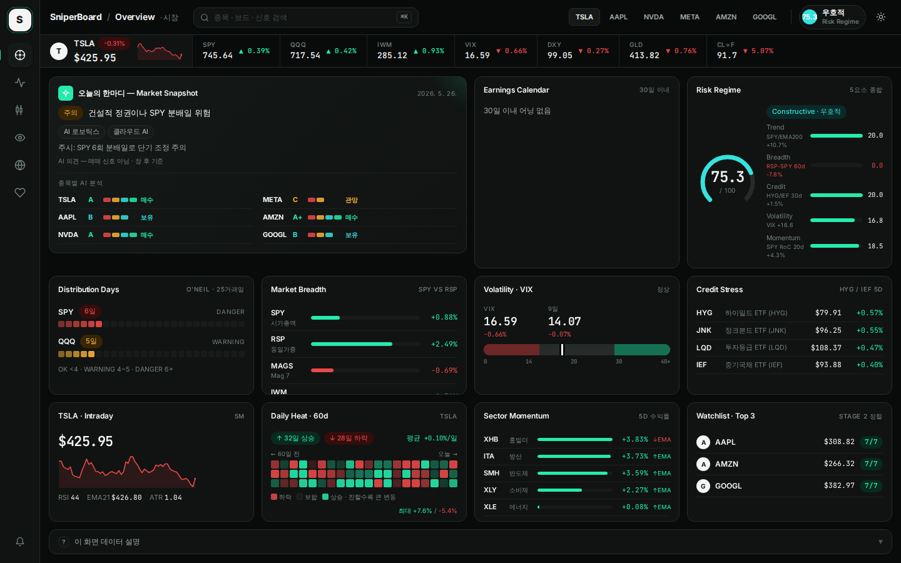
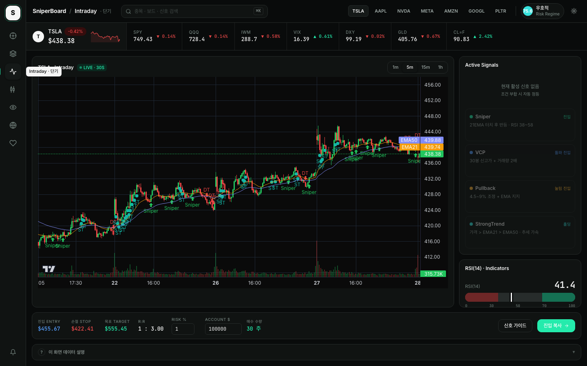
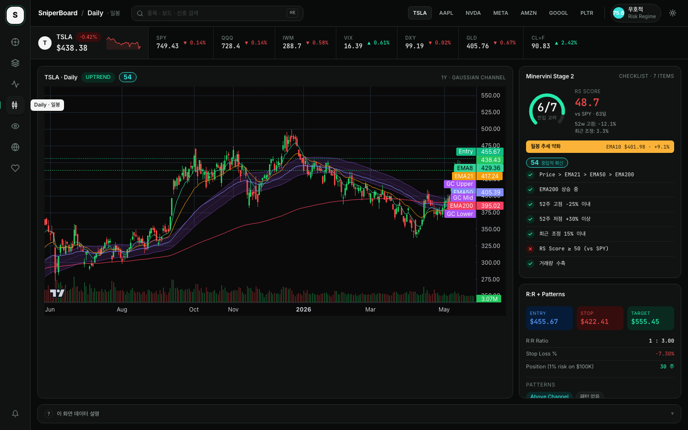
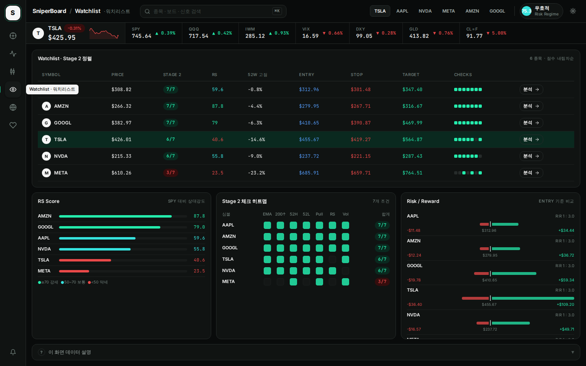
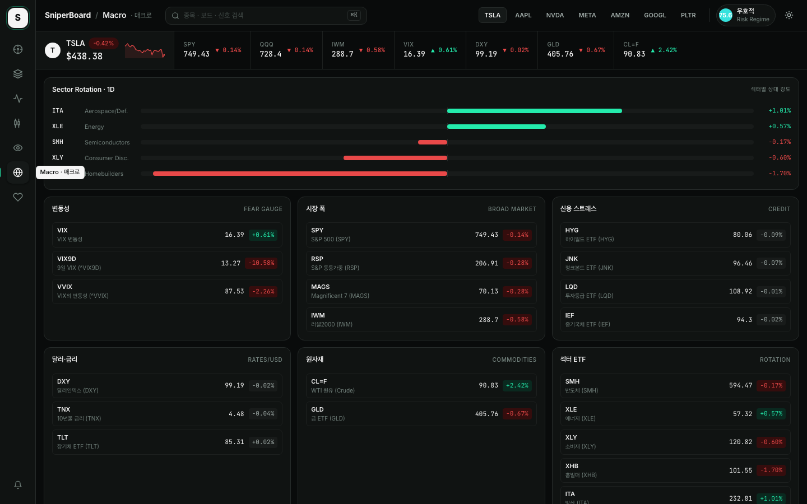
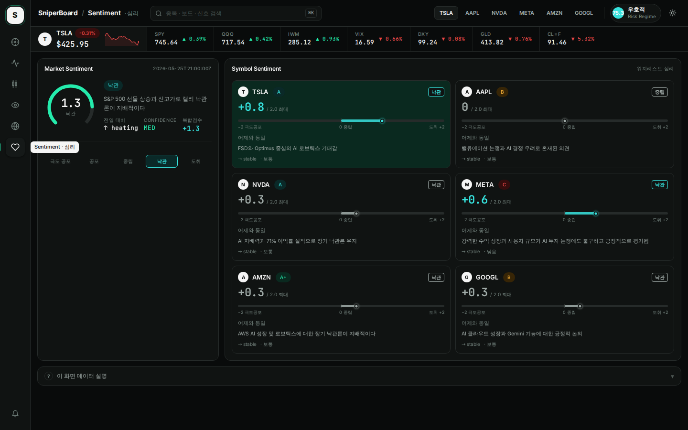

# SniperBoard

**Precision Signal Dashboard for US Equities**
*Livermore · O'Neil · Minervini 전략 기반 스윙 트레이딩 대시보드*

[](https://nextjs.org/)
[](https://fastapi.tiangolo.com/)
[](https://python.org/)
[](https://docs.docker.com/compose/)

---

## 개요

SniperBoard는 미국 주식 스윙 트레이딩을 위한 웹 기반 매매 신호 대시보드입니다.

- **백엔드**: FastAPI + yfinance + pandas로 실시간 신호 계산
- **프론트엔드**: Next.js 16 + lightweight-charts로 인터랙티브 차트 제공
- **신호 철학**: VCP·Sniper·Pullback(O'Neil/Livermore) + Stage 2(Minervini) + Risk Regime + Distribution Day

딥 다크 테마 기반의 프리미엄 트레이딩 UI. 글래스모피즘 카드, 색상 글로우, 실시간 신호 펄스 애니메이션을 적용합니다.

---

## 빠른 시작

### 요구사항

- Docker & Docker Compose v2

### 실행

```bash
git clone <repo-url>
cd sniperboard

# 1. 환경변수 파일 생성 (최초 1회)
cp .env.example .env
# .env 내용을 필요에 맞게 수정 (아래 "환경변수 설정" 섹션 참고)

# 2. 빌드 및 실행
docker compose up --build -d
```

| 서비스 | URL |
|--------|-----|
| 대시보드 | http://localhost:4000 |
| API 문서 | http://localhost:5001/docs |

> 첫 로딩 시 yfinance 데이터 다운로드로 30초~2분 소요될 수 있습니다.

---

## 환경변수 설정

SniperBoard는 두 곳에서 환경변수를 관리합니다.

### 1. `.env` — 프론트엔드 빌드 변수

루트의 `.env.example`을 복사해 `.env`를 만듭니다.

```bash
cp .env.example .env
```

| 변수 | 기본값 | 설명 |
|------|--------|------|
| `NEXT_PUBLIC_API_URL` | `http://localhost:5001` | 프론트엔드가 호출하는 백엔드 API 주소. 외부 서버나 다른 IP에 배포할 경우 해당 주소로 변경. |

> **주의**: `NEXT_PUBLIC_API_URL`은 **빌드 시 번들**됩니다. 값을 바꾼 후에는 반드시 `docker compose up --build`로 재빌드해야 반영됩니다.

```env
# 로컬 기본값 (변경 불필요)
NEXT_PUBLIC_API_URL=http://localhost:5001

# 외부 IP로 접근하는 경우 예시
NEXT_PUBLIC_API_URL=http://192.168.1.100:5001
```

---

### 2. `docker-compose.yml` — 백엔드 환경변수

백엔드 컨테이너의 환경변수는 `docker-compose.yml`의 `environment` 블록에서 직접 수정합니다.

| 변수 | 필수 | 설명 |
|------|------|------|
| `SENTIMENT_DATA_URL` | 선택 | 소셜 심리 데이터 JSON의 GitHub raw URL. 미설정 시 Sentiment 보드 비활성화. |
| `SENTIMENT_DATA_HISTORY_BASE` | 선택 | 심리 히스토리 파일들이 있는 디렉토리 base URL (파일명 제외). |
| `BRIEF_DATA_URL` | 선택 | AI Daily Brief JSON의 GitHub raw URL. 미설정 시 Market Snapshot에 Regime 텍스트로 대체. |
| `EARNINGS_DATA_URL` | 선택 | Earnings Intelligence JSON의 GitHub raw URL. 미설정 시 Earnings Calendar 카드 숨김. |
| `SENTIMENT_DATA_TOKEN` | 선택 | GitHub PAT. 데이터 리포가 **private**일 때만 필요. Public이면 빈 값으로 둬도 됩니다. |

```yaml
# docker-compose.yml 수정 예시
environment:
  SENTIMENT_DATA_URL: "https://raw.githubusercontent.com/<user>/<repo>/main/latest.json"
  SENTIMENT_DATA_HISTORY_BASE: "https://raw.githubusercontent.com/<user>/<repo>/main/history"
  BRIEF_DATA_URL: "https://raw.githubusercontent.com/<user>/<repo>/main/brief/latest.json"
  EARNINGS_DATA_URL: "https://raw.githubusercontent.com/<user>/<repo>/main/earnings/latest.json"
  SENTIMENT_DATA_TOKEN: ""   # private 리포인 경우 GitHub PAT 입력
```

> **선택 변수 미설정 시 동작**: 오류 없이 실행되며, 해당 데이터를 사용하는 카드만 "로딩 중..." 또는 fallback 텍스트로 표시됩니다. 기본 매매 신호(Intraday·Daily·Watchlist·Macro·Regime)는 환경변수 없이도 정상 동작합니다.

---

## 화면 스크린샷

### Overview — 시장 한눈에 보기



### Intraday — 실시간 신호 대시보드



### Daily — Stage 2 + Gaussian Channel



### Watchlist — Stage 2 정렬 테이블



### Macro — 섹터 로테이션 + 글로벌 지표



### Sentiment — 시장 심리 분석



---

## 화면 구성 (7 보드)

### Deep Dive — 종합 종목 분석

레일에서 **Layers 아이콘 (2번째)** 클릭. 기본 종목 TSLA. 보드 안에서 즉시 전환 가능.

한 종목에 대한 모든 관점을 하나의 흐름으로 배치한 종합 분석 보드입니다.

#### 화면 구성 (4-Zone)

**Zone 0 — 상황 인식 바 (전체 너비)**
종목 선택 버튼(TSLA·AAPL·NVDA·META·AMZN·GOOGL·PLTR) + 현재가·RSI·EMA21 + 인트라데이 스파크라인 + 우측에 Stage2 점수 / Conviction / 월봉 단계 / 시장구조 / 활성 신호 배지를 한 줄로 표시 — 진입 즉시 "지금 어떤 상태인가" 파악

**Zone 1 — 기술 심층 (60% : 40%)**
- 좌: **Daily Chart** — 1년 일봉 캔들 + EMA8/21/50/200 + 가우시안 채널 + Entry/Stop 라인
- 우(스택): **Stage 2 체크리스트** (7항목 2컬럼 + 월봉 상태 배너 + RS Score · 52주이격 · 조정폭 · EMA200기울기 KPI) → **R:R 진입 계획** (Entry/Stop/Target + 빨강1:녹색3 시각 바 + 포지션 수량 + Max Loss/ATR)

**Zone 2 — 심리 & AI (3등분)**
- **소셜 심리**: composite_score(-2~+2) ScoreBar + 전일 델타 + 핵심 이유 + 주요 뉴스 + 심리 추이 차트 토글
- **AI 분석 Brief**: Setup Quality(A+~D) + Action Bias 배지 + 분석문 + 기회/리스크 블록
- **실적 발표** + **시장 전체 심리**: 발표일·D-Day·EPS추정·Beat율 + 시장 composite_score 게이지

**Zone 3 — 맥락 (60% : 40%)**
- **Daily Heat 60d**: 60거래일 일봉 등락률 히트맵 (3행×20열) + 최대 등락
- **Risk Regime**: RadialGauge(0~100) + 레짐 텍스트 설명 + 5요소 바(Trend/Breadth/Credit/Volatility/Momentum)

---

### Overview

시장 전체 상황을 한 화면에서 파악하는 메인 보드입니다. 8개 카드로 구성됩니다.

- **AI Market Snapshot**: Grok AI가 생성한 시장 내러티브 (tone · key_themes · watch_points) + 종목별 AI 분석 (Setup Quality A+~D · Action Bias · 한 줄 요약)
- **Earnings Calendar**: 워치리스트 30일 이내 실적 발표 일정 — 리스크 등급(high/med/low) + 임박/진입권/관망 티어
- **Risk Regime**: 매크로 환경 0~100점 종합 (5요소: Trend·Breadth·Credit·Volatility·Momentum + 원시 수치)
- **Distribution Days**: SPY·QQQ 기관 분배일 카운트 (O'Neil, 25거래일 기준 · OK/WARNING/DANGER)
- **Market Breadth**: SPY·RSP·MAGS·IWM 5일 수익률 비교 — 협소 랠리(Mag7 주도) 자동 경고
- **Volatility · VIX**: ^VIX + ^VIX9D 레벨 + 게이지 바 + 백워데이션 자동 감지
- **Credit Stress**: HYG·JNK·LQD·IEF 5일 변화율 — 신용 위험 선행 지표
- **Sector Momentum**: SMH·XLE·XLY·XHB·ITA 5D 수익률 순위 + EMA21 위/아래 상태
- **Symbol Intraday**: 선택 종목 5분봉 스파크라인 + 활성 신호 배지 + RSI/EMA21/ATR
- **Daily Heat · 60d**: 60거래일 등락률 히트맵 + 상승/하락일 통계
- **Watchlist Top 3**: Stage 2 점수 상위 3종목 미리보기

### Intraday (30초 자동 갱신)

- 5분봉/1분봉/15분봉/1시간봉 캔들차트 (EMA21·EMA50 오버레이)
- 6개 매매 신호 마커 차트 위 오버레이 (▲ 매수 / ▼ 경고)
- 활성 신호 카드 — 신호별 조건 가이드 (진입 가격·RSI·EMA 기준)
- RSI(14) 게이지 바
- R:R 계산기 (ATR 기반 자동 진입·손절·목표가 + 포지션 크기)

### Daily

- 252봉(1년) 일봉 차트 (EMA8·21·50·200 + 가우시안 채널)
- Minervini Stage 2 체크리스트 (7항목 / 점수)
- **월봉 추세 배지**: 일봉 데이터를 월봉으로 리샘플링해 10개월 EMA 기준 추세 판별 (상승확인 / 약화 / 중립 / 하락)
- 시장 구조 감지 (HH·HL·LH·LL)
- RSI 다이버전스(상승/하락) + 베어 플래그 패턴 감지
- 가우시안 채널 상태 (돌파·리테스트·이탈)
- R:R 계산기 패널

**AI Daily Brief & Earnings** (OverviewBoard 통합)
- AI Insight 카드: Grok이 기술 지표 + 소셜 심리를 결합한 시장 내러티브 (tone·key_themes) — subtle ⏱ freshness (age_minutes) badge
- Earnings Calendar: 워치리스트 종목 실적 발표 일정 + 리스크 등급(high/med/low) + Grok 요약 — subtle ⏱ freshness badge (Phase 4)

### Watchlist

- TSLA·AAPL·NVDA·META·AMZN·GOOGL Stage 2 점수 내림차순 정렬
- 컬럼: 가격 · Stage 2 점수 · RS Score · 52주 고점 이격 · 진입/손절/목표가 · 7체크 인디케이터 · **월봉** · Conviction
- 행 클릭 시 해당 종목으로 전환 후 Daily 보드 이동

### Macro

- 섹터 로테이션 바 (SMH·ITA·XLE·XHB·XLY 1일 수익률 정렬)
- 6그룹 카드: 변동성(VIX·VIX9D·VVIX) · 시장 폭(SPY·RSP·MAGS·IWM) · 신용(HYG·JNK·LQD·IEF) · 달러금리(DXY·TNX·TLT) · 원자재(CL=F·GLD) · 섹터 ETF(SMH·XLE·XLY·XHB·ITA)
- 21개 심볼 가격 · 1D 변화율 · EMA8/21 위치 · 시장 구조

### Sentiment

- 시장 전체 심리 게이지 (극도공포~도취 5단계 + 복합점수)
- 종목별 심리 카드: 감정 점수·트렌드·멘션량·봇 의심도·핵심 이유
- **카드 클릭 시 심리 추이 차트 펼침**: 주가 라인(좌축) + composite_score 오버레이(우측 −2~+2), 7일/30일 토글
- Setup Quality 배지 (A+~D) — Grok AI 셋업 평가
- 장 전/장 후 슬롯 구분 표시 (▲ pre_open, ● post_close 마커)

---

## 매매 신호

### 6개 단기 신호

| 신호 | 조건 요약 | 행동 |
|------|-----------|------|
| **Sniper** | 21EMA 0.4% 이내 + RSI 38~58 + 거래량 전봉 대비 1.4배 | 진입 |
| **VCP** | 30봉 신고가 + 거래량 2배 + ATR 8봉 연속 수축 | 돌파 진입 |
| **Pullback** | 15봉 고점 대비 4.5~9% 조정 + EMA 지지 + MACD 3봉 반등 | 눌림 진입 |
| **StrongTrend** | 가격>EMA21>EMA50 + EMA 기울기 +0.15% + RSI 52~78 | 홀딩 |
| **Overbought** | RSI≥76 + 21EMA 이격 +3.2% + 5봉 중 4양봉 | 분할 익절 |
| **Downtrend** | 가격<EMA21 + 음의 기울기 + 거래량 급증 + 8봉 신저가 | 접근 금지 |

### Stage 2 체크리스트 (Minervini)

| 항목 | 기준 |
|------|------|
| Price > EMA21 > EMA50 > EMA200 | 이평선 정배열 |
| EMA200 상승 중 | 20일 기울기 양수 |
| 52주 고점 -25% 이내 | 52주 고점 대비 조정 제한 |
| 52주 저점 +30% 이상 | 저점 대비 충분한 반등 |
| 최근 조정 15% 이내 | 20일 고점 대비 얕은 조정 |
| RS Score ≥ 50 | 63일 수익률 SPY 대비 우위 |
| 거래량 수축 | 5일 평균 < 20일 평균 |

**점수**: 6~7점 진입 고려 / 4~5점 관망 / 3점 이하 회피

### Risk Regime

| 등급 | 점수 | 의미 |
|------|------|------|
| RISK_ON (강세) | 80~100 | 추세 추종 전략 유효 |
| CONSTRUCTIVE (우호적) | 60~79 | 선별적 진입 가능 |
| MIXED (혼조) | 40~59 | 포지션 사이즈 축소 |
| DEFENSIVE (방어적) | 20~39 | 현금 비중 확대 |
| RISK_OFF (약세) | 0~19 | 신규 매수 자제 |

### R:R 계산기

```
진입가 = 피벗 고점 × 1.005
손절가 = 진입가 − 2 × ATR(14)
목표가 = 진입가 + 3 × (진입가 − 손절가)   → R:R = 1:3
매수 수량 = (계좌 × 리스크%) ÷ (진입가 − 손절가)
```

---

## API 엔드포인트

| 경로 | 설명 |
|------|------|
| `GET /api/ohlcv?symbol=&tf=` | 단기 OHLCV + 6신호 불리언 배열 + 지표 |
| `GET /api/latest-signal?symbol=&tf=` | 최신 캔들 신호 요약 |
| `GET /api/daily?symbol=` | 252봉 일봉 + Stage2 전체 분석 |
| `GET /api/macro` | 21개 매크로 심볼 가격·변화율·지표 |
| `GET /api/watchlist` | 6종목 Stage2 점수 순 정렬 |
| `GET /api/regime` | Risk Regime 5요소 종합 점수 |
| `GET /api/distribution-days` | SPY·QQQ Distribution Day 카운트 |
| `GET /api/sentiment` | 소셜 심리 데이터 (GitHub raw 캐시) + `meta {fetched_at, age_minutes, source}` (Task 3) |
| `GET /api/sentiment/history` | N일치 심리 포인트 배열. `?symbol=TSLA&days=7` (days: 1-30). 5분 TTL 캐시. |
| `GET /api/brief` | AI Daily Brief — Grok 시장 분석 (GitHub raw 캐시) + `meta {fetched_at, age_minutes, source}` (Task 3) |
| `GET /api/earnings` | Earnings Intelligence — 실적 발표 일정 + AI 해석 (GitHub raw 캐시) + `meta {fetched_at, age_minutes, source}` (Task 3) |

전체 응답 스키마: `backend/api/schemas.py` 참고

> **Phase 1 진행 중**:
> - Conviction Composite Score v1 계산 엔진 (`core/conviction_calculator.py`) TDD 완료.
> - Conviction 신뢰성 강화 + 에러/로딩 대응 + UI 세련되게 다듬음 (WatchlistBoard, DailyBoard). 테스트 12개.

**Phase 1 빠른 검증 방법**:

```bash
# Option A: Full stack (recommended for real data)
./run_docker.sh
# (wait 30-60s)
./scripts/verify_conviction.sh

# Option B: Quick local verification (no Docker, tests the calculator logic)
PYTHONPATH=backend python3 scripts/verify_conviction_local.py
```
> - Brief Context Attribution: `/api/brief` 응답에 최상위 `context` 필드 추가. market-sentiment-data 쪽 수집기도 업데이트됨.

---

## 기술 스택

### Frontend

| 기술 | 버전 | 용도 |
|------|------|------|
| Next.js | 16.2 | React 프레임워크 (App Router) |
| React | 19.2 | UI |
| TypeScript | 5.x | 타입 안전성 |
| Tailwind CSS | 4.x | 스타일링 |
| lightweight-charts | 4.2 | 캔들스틱 차트 |
| TanStack Query | 5.x | 서버 상태 관리·캐싱·폴링 |
| Zustand | 5.x | 클라이언트 전역 상태 |

### Backend

| 기술 | 용도 |
|------|------|
| FastAPI | REST API 서버 |
| pandas / numpy | 신호·지표·패턴 계산 |
| yfinance | OHLCV 데이터 수집 |
| uvicorn | ASGI 서버 |
| pytest | 테스트 |

---

## 로컬 개발

```bash
# 백엔드 (port 8000)
cd backend
pip install -r requirements.txt
uvicorn main:app --reload --port 8000

# 프론트엔드 (port 3000)
cd frontend
npm install
NEXT_PUBLIC_API_URL=http://localhost:8000 npm run dev
```

> `NEXT_PUBLIC_API_URL`은 빌드 시 번들됩니다. 변경 시 재빌드 필요.

---

## 주의사항

- yfinance는 개발·테스트용 무료 API입니다 (15분 지연 데이터). 운영 환경에서는 유료 데이터 소스 권장.
- **yfinance 데이터 정확도 강화 + 최소 연계 개선 (full plan: Task 2/3 + Phase 2 + Phase 4 + Phase 5 + exec-8)**: `backend/core/data_adapter.py` is the SINGLE SOURCE OF TRUTH — full centralization + delegation (data_service now thin; daily/watchlist/regime/etc endpoints direct import get_multi_daily for hardened path). Phase 2: `backend/core/signal_engine.py:calculate_stage2_analysis` detects adj_close (preserved by adapter) and uses adjusted prices (scaled high/low + adj series) for long-term metrics (52w high/low, RS 63d, EMA200 slope, pullback, pivot/entry) on split symbols (e.g. NVDA); short-term signals/GC/intraday/raw paths 100% unchanged for full backward compat. Task 3: daily paths + AI endpoints return `meta: {fetched_at, age_minutes, source}`. Phase 4: FE minimal ⏱ freshness badges (OverviewBoard AI Insight + Earnings Calendar + light in Sentiment). Phase 5: full test suites green (sniperboard 29 incl. dedicated adapter+signal_engine; msd 48), mandatory docs updates (PROJECT_CONTEXT/README per CLAUDE.md), final manual verification (endpoints spot-checks, no-breakage non-split/intraday, badges conceptually sound). Cross-repo linkage: market-sentiment-data `collect/collect_earnings.py` hardening (structured logging, fallbacks, schema validation, partial graceful output, --dry-run) + improved services/brief/earnings linkage via GitHub raw + meta transparency. (2026-05-24, feat/yf-accuracy-harden-2026-05-25 branch complete)
- **Phase 1 Conviction Composite Score v1 (연계 강화)**: `backend/core/conviction_calculator.py` + `tests/test_conviction_calculator.py` TDD 완료 (RED-GREEN, 2026-05-25). 40/30/30 weighted (Stage2 score 0-7 + Sentiment + Regime total). 아직 어떤 엔드포인트에도 노출되지 않음. 다음 슬라이스에서 /api/watchlist 등 연동 예정. (PROJECT_CONTEXT.md + README.md 동시 업데이트 per CLAUDE.md)
- 매매 신호와 분석은 **참고용**입니다. 투자 손실에 대한 책임은 사용자 본인에게 있습니다.
- Risk Regime · Distribution Day는 **후행 지표**입니다 — 매매 신호가 아닌 시장 환경 진단입니다.
- 미국 주식 시장 운영 시간(ET 09:30–16:00) 외에는 단기 데이터가 갱신되지 않습니다.
- CORS는 현재 개발용으로 모든 origin을 허용합니다 (`allow_origins=["*"]`).

---

## 라이선스

MIT © pjhwa
