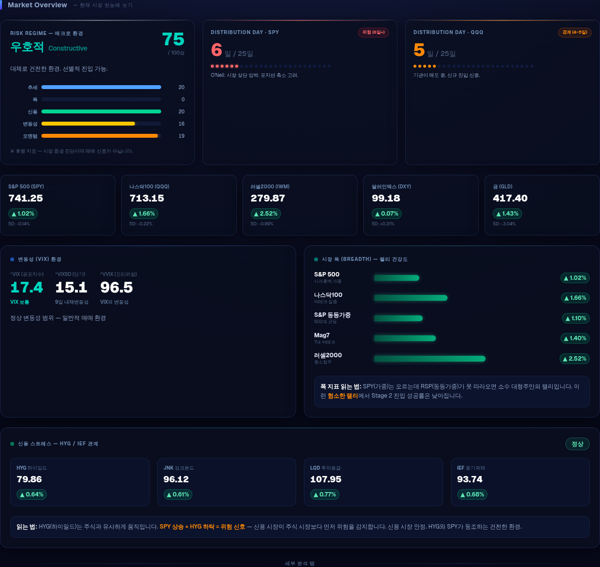

# SniperBoard

**Precision Signal Dashboard for US Equities**
*Livermore · O'Neil · Minervini 전략 기반 스윙 트레이딩 대시보드*

[](https://nextjs.org/)
[](https://fastapi.tiangolo.com/)
[](https://python.org/)
[](https://docs.docker.com/compose/)

---

## 개요

SniperBoard는 미국 주식 스윙 트레이딩을 위한 웹 기반 매매 신호 대시보드입니다.

- **백엔드**: FastAPI + yfinance + pandas로 실시간 신호 계산
- **프론트엔드**: Next.js 16 + lightweight-charts로 인터랙티브 차트 제공
- **신호 철학**: VCP·Sniper·Pullback(O'Neil/Livermore) + Stage 2(Minervini) + Risk Regime + Distribution Day

딥 네이비 다크 테마(`#07091a`) 기반의 프리미엄 트레이딩 UI. 글래스모피즘 카드, 색상 글로우, 실시간 신호 펄스 애니메이션을 적용합니다.

---

## 빠른 시작

### 요구사항

- Docker & Docker Compose v2

### 실행

```bash
git clone <repo-url>
cd sniperboard
docker compose up --build -d
```

| 서비스 | URL |
|--------|-----|
| 대시보드 | http://localhost:4000 |
| API 문서 | http://localhost:5001/docs |

> 첫 로딩 시 yfinance 데이터 다운로드로 30초~2분 소요될 수 있습니다.

---

## 화면 스크린샷

### Market Overview — 시장 한눈에 보기



### 단기 (Intraday) — 실시간 신호 대시보드


### 일봉 분석 (Daily) — Stage 2 + Gaussian Channel


### 매크로 (Macro) — 섹터 로테이션 + 글로벌 지표


---

## 화면 구성

### Market Overview (항상 상단 표시)

모든 탭 위에 고정되는 시장 한눈에 보기 패널입니다.

- **Risk Regime 카드**: 매크로 환경을 0~100점으로 종합 (5요소: 추세·폭·신용·변동성·모멘텀)
- **Distribution Day 카드**: SPY·QQQ 기관 분배일 수 (O'Neil 원전, 25거래일 기준)
- **핵심 지수 스냅샷**: SPY·QQQ·IWM·DXY·GLD 가격 및 1D/5D 수익률
- **VIX 패널**: ^VIX + ^VIX9D + ^VVIX + 백워데이션 자동 감지
- **시장 폭 패널**: SPY vs RSP 비교 — 협소한 랠리 자동 경고
- **신용 스트레스 패널**: HYG·JNK·LQD·IEF 관계 분석

### 4개 탭

**단기 (Intraday)** — 30초 자동 갱신
- 5분봉/1분봉 캔들차트 (EMA21·EMA50 오버레이)
- 6개 매매 신호 마커 (▲ 매수 / ▼ 경고)
- RSI(14) 게이지 바
- 현재 활성 신호 카드 + 신호별 조건 가이드

**일봉 분석 (Daily)**
- 1년 일봉 차트 (EMA8·21·50·200 + 가우시안 채널)
- Minervini Stage 2 체크리스트 (7항목 점수)
- 시장 구조 감지 (HH/HL/LH/LL)
- RSI 다이버전스 / 베어 플래그 패턴 감지
- 가우시안 채널 상태 (돌파·리테스트·이탈)
- R:R 계산기 (ATR 기반 자동 진입·손절·목표가 + 포지션 크기)

**워치리스트**
- TSLA·AAPL·NVDA·META·AMZN·GOOGL Stage 2 점수 순 정렬
- 7개 체크 항목, RS Score, 52주 고점 이격, 진입/손절/목표가

**심리 분석 (Sentiment)**
- 소셜 심리 게이지: 시장 전체 감정 스코어 및 트렌드
- 종목별 심리 카드: 멘션량·봇 의심도·다이버전스 + Grok AI 셋업 품질 배지(A+~D)

**AI Daily Brief & Earnings** (OverviewBoard 통합)
- AI Insight 카드: Grok이 기술 지표 + 소셜 심리를 결합한 시장 내러티브 (tone·key_themes)
- Earnings Calendar: 워치리스트 종목 실적 발표 일정 + 리스크 등급(high/med/low) + Grok 요약

**매크로 (Macro)**
- 섹터 로테이션 바 (SMH·XLE·XLY·XHB·ITA 1일 수익률 정렬)
- VIX 백워데이션 배지 자동 표시
- 21개 심볼 6그룹 카드 (변동성·폭·신용·달러금리·원자재·섹터)

---

## 매매 신호

### 6개 단기 신호

| 신호 | 조건 요약 | 행동 |
|------|-----------|------|
| **Sniper** | 21EMA 0.4% 이내 + RSI 38~58 + 거래량 전봉 대비 1.4배 | 진입 |
| **VCP** | 30봉 신고가 + 거래량 2배 + ATR 8봉 연속 수축 | 돌파 진입 |
| **Pullback** | 15봉 고점 대비 4.5~9% 조정 + EMA 지지 + MACD 3봉 반등 | 눌림 진입 |
| **StrongTrend** | 가격>EMA21>EMA50 + EMA 기울기 +0.15% + RSI 52~78 | 홀딩 |
| **Overbought** | RSI≥76 + 21EMA 이격 +3.2% + 5봉 중 4양봉 | 분할 익절 |
| **Downtrend** | 가격<EMA21 + 음의 기울기 + 거래량 급증 + 8봉 신저가 | 접근 금지 |

### Stage 2 체크리스트 (Minervini)

| 항목 | 기준 |
|------|------|
| Price > EMA21 > EMA50 > EMA200 | 이평선 정배열 |
| EMA200 상승 중 | 20일 기울기 양수 |
| 52주 고점 -25% 이내 | 52주 고점 대비 조정 제한 |
| 52주 저점 +30% 이상 | 저점 대비 충분한 반등 |
| 최근 조정 15% 이내 | 20일 고점 대비 얕은 조정 |
| RS Score ≥ 50 | 63일 수익률 SPY 대비 우위 |
| 거래량 수축 | 5일 평균 < 20일 평균 |

**점수**: 6~7점 진입 고려 / 4~5점 관망 / 3점 이하 회피

### Risk Regime

| 등급 | 점수 | 의미 |
|------|------|------|
| RISK_ON (강세) | 80~100 | 추세 추종 전략 유효 |
| CONSTRUCTIVE (우호적) | 60~79 | 선별적 진입 가능 |
| MIXED (혼조) | 40~59 | 포지션 사이즈 축소 |
| DEFENSIVE (방어적) | 20~39 | 현금 비중 확대 |
| RISK_OFF (약세) | 0~19 | 신규 매수 자제 |

### R:R 계산기

```
진입가 = 20일 고점 × 1.005
손절가 = 진입가 − 2 × ATR(14)
목표가 = 진입가 + 3 × (진입가 − 손절가)   → R:R = 1:3
매수 수량 = (계좌 × 리스크%) ÷ (진입가 − 손절가)
```

---

## API 엔드포인트

| 경로 | 설명 |
|------|------|
| `GET /api/ohlcv?symbol=&tf=` | 단기 OHLCV + 6신호 불리언 배열 + 지표 |
| `GET /api/latest-signal?symbol=&tf=` | 최신 캔들 신호 요약 |
| `GET /api/daily?symbol=` | 252봉 일봉 + Stage2 전체 분석 |
| `GET /api/macro` | 21개 매크로 심볼 가격·변화율·지표 |
| `GET /api/watchlist` | 6종목 Stage2 점수 순 정렬 |
| `GET /api/regime` | Risk Regime 5요소 종합 점수 |
| `GET /api/distribution-days` | SPY·QQQ Distribution Day 카운트 |
| `GET /api/sentiment` | 소셜 심리 데이터 (GitHub raw 캐시) |
| `GET /api/brief` | AI Daily Brief — Grok 시장 분석 (GitHub raw 캐시) |
| `GET /api/earnings` | Earnings Intelligence — 실적 발표 일정 + AI 해석 (GitHub raw 캐시) |

전체 응답 스키마: `backend/api/schemas.py` 참고

---

## 기술 스택

### Frontend

| 기술 | 버전 | 용도 |
|------|------|------|
| Next.js | 16.2 | React 프레임워크 (App Router) |
| React | 19.2 | UI |
| TypeScript | 5.x | 타입 안전성 |
| Tailwind CSS | 4.x | 스타일링 |
| lightweight-charts | 4.2 | 캔들스틱 차트 |
| TanStack Query | 5.x | 서버 상태 관리·캐싱·폴링 |
| Zustand | 5.x | 클라이언트 전역 상태 |

### Backend

| 기술 | 용도 |
|------|------|
| FastAPI | REST API 서버 |
| pandas / numpy | 신호·지표·패턴 계산 |
| yfinance | OHLCV 데이터 수집 |
| uvicorn | ASGI 서버 |
| pytest | 테스트 |

---

## 로컬 개발

```bash
# 백엔드 (port 8000)
cd backend
pip install -r requirements.txt
uvicorn main:app --reload --port 8000

# 프론트엔드 (port 3000)
cd frontend
npm install
NEXT_PUBLIC_API_URL=http://localhost:8000 npm run dev
```

> `NEXT_PUBLIC_API_URL`은 빌드 시 번들됩니다. 변경 시 재빌드 필요.

---

## 주의사항

- yfinance는 개발·테스트용 무료 API입니다 (15분 지연 데이터). 운영 환경에서는 유료 데이터 소스 권장.
- **yfinance 데이터 정확도 강화 진행 중 (Task 2 완료)**: `backend/core/data_adapter.py` (normalize + get_daily + get_ohlcv_intraday) 에 MultiIndex 정규화 TDD 로 격리. `data_service` 의 get_ohlcv(인트라데이)와 get_multi_daily 가 어댑터로 위임 (중앙화, ad-hoc 제거). (2026-05)
- 매매 신호와 분석은 **참고용**입니다. 투자 손실에 대한 책임은 사용자 본인에게 있습니다.
- Risk Regime · Distribution Day는 **후행 지표**입니다 — 매매 신호가 아닌 시장 환경 진단입니다.
- 미국 주식 시장 운영 시간(ET 09:30–16:00) 외에는 단기 데이터가 갱신되지 않습니다.
- CORS는 현재 개발용으로 모든 origin을 허용합니다 (`allow_origins=["*"]`).

---

## 라이선스

MIT © pjhwa
