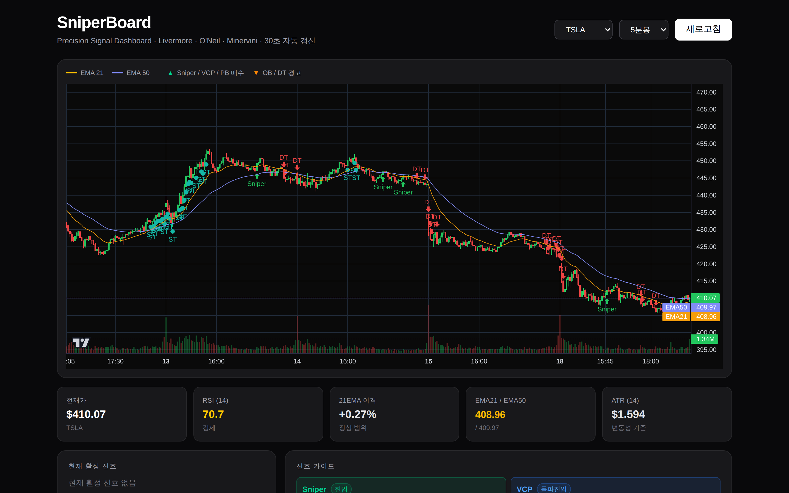

<div align="center">

# ⚡ SniperBoard

**Precision Signal Dashboard for US Equities**

*Livermore · O'Neil · Minervini 전략 기반 실시간 매매 신호 대시보드*

[](https://nextjs.org/)
[](https://fastapi.tiangolo.com/)
[](https://python.org/)
[](https://docs.docker.com/compose/)
[](LICENSE)

</div>

---

## 📸 Screenshot



---

## 📌 Overview

SniperBoard는 미국 주식 시장을 위한 **TradingView 스타일의 웹 기반 매매 신호 대시보드**입니다.  
기관의 수급 흐름과 추세 모멘텀을 분석하여 **6가지 핵심 신호**를 실시간으로 시각화합니다.

```
브라우저 ──► Next.js Frontend (포트 4000)
                    │
                    ▼ REST API
             FastAPI Backend (포트 5000)
                    │
                    ├── /api/ohlcv          OHLCV + 지표 + 신호
                    ├── /api/latest-signal  최신 신호 요약
                    └── Signal Engine       pandas_ta 기반 6신호 계산
                              │
                              ▼
                         yfinance (OHLCV 데이터)
```

---

## 🎯 6가지 매매 신호

| 신호 | 색상 | 설명 | 행동 |
|------|------|------|------|
| **Sniper** | 🟢 | 21EMA 0.4% 이내 접근 + RSI 38~58 + 거래량 급증 | 진입 |
| **VCP** | 🔵 | 30봉 신고가 + 거래량 2배 + ATR 8봉 연속 축소 | 돌파 진입 |
| **Pullback** | 🟡 | 고점 대비 4.5~9% 조정 + EMA 지지 + MACD 전환 | 눌림 진입 |
| **StrongTrend** | 🩵 | 가격 > 21EMA > 50EMA + EMA 기울기 +0.15% | 홀딩 |
| **Overbought** | 🟠 | RSI ≥ 76 + 21EMA 이격 +3.2% + 5봉 중 4양봉 | 분할 익절 |
| **Downtrend** | 🔴 | 가격 < 21EMA + EMA 음의 기울기 + 거래량 급증 | 접근 금지 |

---

## 🖥️ 주요 기능

- **실시간 캔들스틱 차트** — lightweight-charts 기반, 30초 자동 갱신
- **EMA 오버레이** — EMA21 (황색) / EMA50 (인디고) 라인
- **거래량 히스토그램** — 차트 하단 20%, 양봉/음봉 색상 구분
- **6개 신호 마커** — 차트 위 매수(▲) / 경고(▼) 마커
- **RSI 게이지 바** — 과매도 / 중립 / 강세 / 과열 구간 시각화
- **EMA 이격률** — 21EMA 대비 현재 이격 (3.2% 초과 시 경고)
- **ATR 표시** — 현재 변동성 기준값
- **종목 선택** — TSLA / AAPL / NVDA / META / AMZN / GOOGL
- **타임프레임** — 5분봉 (메인) / 1분봉 (보조)

---

## 🚀 빠른 시작

### 요구사항

- [Docker](https://docs.docker.com/get-docker/) & Docker Compose
- Git

### 1. 클론

```bash
git clone https://github.com/pjhwa/sniperboard.git
cd sniperboard
```

### 2. 환경 변수 설정 (선택)

```bash
# docker-compose.yml 의 NEXT_PUBLIC_API_URL 을 서버 IP에 맞게 수정
# 기본값: http://192.168.1.100:5000
```

### 3. 실행

```bash
docker compose up --build -d
```

| 서비스 | URL |
|--------|-----|
| 대시보드 | http://localhost:4000 |
| API | http://localhost:5000/docs |

---

## 🛠️ 로컬 개발

### 백엔드

```bash
cd backend
pip install -r requirements.txt
uvicorn main:app --reload --port 5000
```

### 프론트엔드

```bash
cd frontend
npm install
NEXT_PUBLIC_API_URL=http://localhost:5000 npm run dev
```

---

## 📡 API 엔드포인트

### `GET /api/ohlcv`

OHLCV 캔들 데이터 + 6신호 + 보조 지표를 반환합니다.

| 파라미터 | 타입 | 기본값 | 설명 |
|----------|------|--------|------|
| `symbol` | string | — | 종목 코드 (예: `TSLA`) |
| `tf` | string | `5m` | 타임프레임 (`1m`, `5m`) |

```jsonc
// 응답 예시
{
  "symbol": "TSLA",
  "timeframe": "5m",
  "candles": [
    { "time": "2026-05-19T14:30:00+00:00", "open": 320.1, "high": 322.5, "low": 319.8, "close": 321.4, "volume": 512000 }
  ],
  "signals": {
    "vcp":          [false, false, true, ...],
    "sniper":       [false, true,  false, ...],
    "pullback":     [false, false, false, ...],
    "strong_trend": [true,  true,  false, ...],
    "overbought":   [false, false, false, ...],
    "downtrend":    [false, false, false, ...]
  },
  "indicators": {
    "ema21": [319.2, 319.5, ...],
    "ema50": [316.8, 317.0, ...],
    "rsi":   [54.2,  55.1, ...],
    "atr":   [1.82,  1.79, ...]
  }
}
```

### `GET /api/latest-signal`

최신 캔들 기준 신호 요약을 반환합니다.

```jsonc
{
  "symbol": "TSLA",
  "timeframe": "5m",
  "active_signals": ["sniper"],
  "latest_price": 321.4,
  "latest_rsi": 55.1,
  "latest_ema21": 319.5,
  "latest_ema50": 317.0,
  "latest_atr": 1.79
}
```

---

## 🏗️ 기술 스택

### Frontend

| 기술 | 버전 | 용도 |
|------|------|------|
| Next.js | 16.2 | React 프레임워크 |
| React | 19.2 | UI |
| TypeScript | 5.x | 타입 안전성 |
| Tailwind CSS | 4.x | 스타일링 |
| lightweight-charts | 4.2 | 캔들스틱 차트 |

### Backend

| 기술 | 용도 |
|------|------|
| FastAPI | REST API 서버 |
| pandas | 신호 계산 |
| yfinance | OHLCV 데이터 수집 |
| uvicorn | ASGI 서버 |

---

## 📁 프로젝트 구조

```
sniperboard/
├── backend/
│   ├── api/
│   │   └── endpoints.py        # REST API 라우터
│   ├── core/
│   │   └── signal_engine.py    # 6신호 계산 엔진
│   ├── services/
│   │   └── data_service.py     # yfinance 데이터 수집
│   ├── main.py
│   ├── Dockerfile
│   └── requirements.txt
├── frontend/
│   ├── app/
│   │   ├── page.tsx            # 메인 대시보드
│   │   └── layout.tsx
│   ├── Dockerfile
│   ├── next.config.ts
│   └── package.json
├── docker-compose.yml
└── README.md
```

---

## ⚠️ 주의사항

- yfinance는 개발/테스트용입니다. 운영 환경에서는 [Polygon.io](https://polygon.io/) 등 유료 데이터 소스 사용을 권장합니다.
- 매매 신호는 **참고용**이며 투자 손실에 대한 책임은 사용자 본인에게 있습니다.
- 미국 주식 시장 운영 시간(ET 09:30–16:00) 외에는 데이터가 갱신되지 않습니다.

---

## 📄 License

MIT © [pjhwa](https://github.com/pjhwa)
